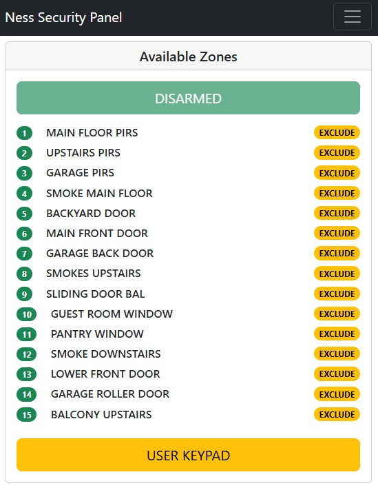
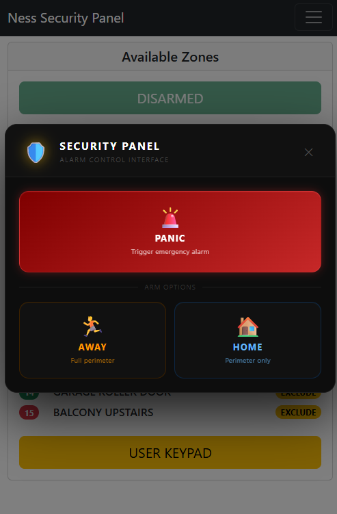
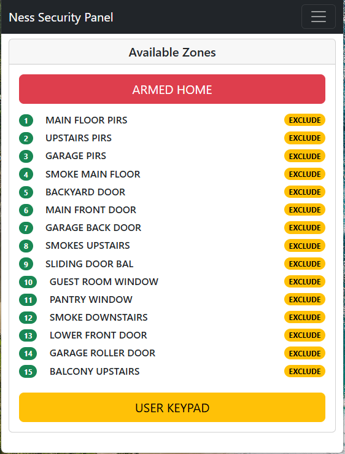
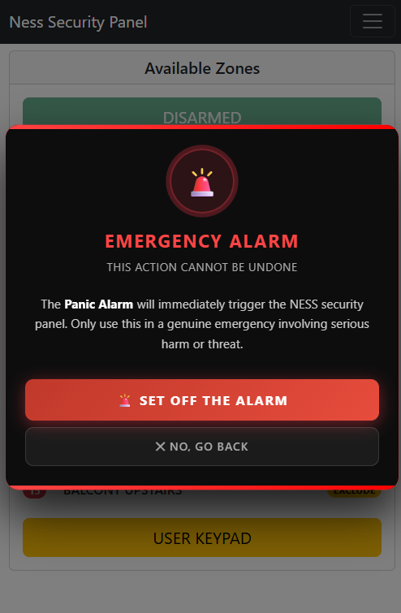
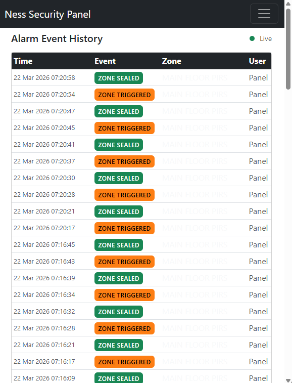

# NESS 2 Web Application

A self-hosted web application that bridges the **[Ness2Wifi PCB](https://github.com/afkiwers/ness2web_pcb)** to a modern browser-based UI. The Ness2Wifi bridge connects a NESS DX8/DX16 security panel to your WiFi network, and this application provides real-time monitoring and control over any device with a web browser.

---

## Features

- Real-time zone and system status via WebSockets — no polling, instant updates
- Arm Away, Arm Home, and Disarm from any browser
- Optional Panic mode (per-user permission, requires confirmation)
- Zone exclusion management
- Per-zone event history and full system event history
- Zone settings — rename zones, hide zones from the dashboard
- Multi-user support with two-factor authentication (TOTP)
- Brute-force lockout (django-axes) with configurable limits
- REST API with token and API key authentication
- Persistent sessions (30-day cookies, survive browser close)
- Deployed via Docker Compose with Nginx and Redis

---

## Architecture

```
Browser ──HTTP/WebSocket──┐
                          ├──► Nginx ──► Django / Daphne (ASGI) ──► Redis (channel layer)
ESP32 ────────HTTP────────┘                       │
                                            MariaDB / MySQL
```

- **Nginx** — reverse proxy, terminates connections and serves static files
- **Django + Daphne** — ASGI server handling both HTTP and WebSocket connections
- **Redis** — Django Channels layer for broadcasting state updates to all connected browser clients simultaneously
- **MariaDB / MySQL** — persistent storage for users, zones, system status, and event log
- **Ness2Wifi ESP32** — polls Django for pending user commands and pushes panel state updates via HTTP

---

## Web Interface

The main dashboard displays all zones and the current system state. It updates in real time as the panel reports changes. The interface is intentionally minimal — zone controls are limited to exclusion management directly from each zone row.



### User Keypad

Click the **User Keypad** button to open the arming modal. Available actions:

| Button | Description |
|---|---|
| **AWAY** | Arms the panel in Away mode |
| **HOME** | Arms the panel in Home mode |
| **DISARM** | Disarms the panel |
| **PANIC** | Triggers a panic alarm (privileged users only) |

The UI does not optimistically update — it waits for the ESP to confirm the state change before reflecting it on screen.



If a command is still pending when you reload the page, the keypad reopens automatically with the spinner on the appropriate button.

### Armed State

Once armed the status button pulses red and the arm buttons are replaced with a Disarm button.



### PANIC Mode

Users with `enable_panic_mode` permission see a **PANIC** button at the top of the keypad.


Pressing it opens a confirmation dialog before anything is sent to the panel.



### Alarm Event History

The history page (`/history/`) shows the last 100 alarm events in a live-updating table. New events are prepended to the top instantly via WebSocket — no page refresh required. Events are colour-coded by type:

| Event | Colour |
|---|---|
| Armed Away / Armed Home | Red |
| Disarmed | Green |
| Siren On / Panic | Red (pulsing) |
| Zone Triggered | Orange |
| Zone Sealed | Green |
| Zone Excluded / Included | Teal / Purple |



### Zone History

The Zone History page (`/history/zones/`) is accessible from the navigation menu. It lists all visible zones in a table — clicking **View** on any row opens a modal showing the last 50 events recorded for that zone.

---

## Settings

The Settings page (`/settings/`) is accessible to **staff users** from the navigation menu.

### Zone Management

| Column | Description |
|---|---|
| **ID** | The zone number as reported by the NESS panel |
| **Name** | Click the name to rename it inline — saved immediately via API |
| **Hidden** | Whether the zone is hidden from the main dashboard |
| **Status** | Current zone state (Sealed, Open, Excluded, Unknown) |

### Siri Shortcut

The Settings page generates a per-user token for authenticating the Siri Shortcut disarm endpoint (`/shortcuts/disarm/`). The token is shown only once and can be regenerated at any time, which immediately invalidates the old one.

#### Setting up the Shortcut on iPhone / iPad

1. Open the **Shortcuts** app and tap **+** to create a new shortcut
2. Tap **Add Action**, search for **Get Contents of URL**, and select it
3. Set the URL to the value shown on the Settings page (e.g. `https://yourhost/shortcuts/disarm/`)
4. Tap **Show More** and set:
   - **Method** → `POST`
   - Under **Headers**, tap **Add new header**:
     - **Key**: `Authorization`
     - **Value**: `Token <paste your token here>`
5. Optionally add a second action — **Get Dictionary Value** → key `message` — to show the response as a notification
6. Tap the shortcut name at the top to rename it (e.g. *Disarm Alarm*)
7. Tap **Done**

You can now run it from the Shortcuts app, the home screen widget, or by saying **"Hey Siri, Disarm Alarm"**.

> **Note:** The shortcut endpoint uses HTTP Basic Auth with your username and password — the token shown in Settings is used as the password. If you regenerate the token, update the shortcut header value to match.

### System Settings

| Setting | Description |
|---|---|
| **ESP OTA Updates** | Allows the Ness2Wifi bridge to receive over-the-air firmware updates |
| **ESP Offline Banner** | Shows a warning banner on the dashboard if the ESP hasn't checked in for more than 5 minutes. Stored per-device in `localStorage` — off by default |

---

## Deployment

### Prerequisites

- Docker and Docker Compose
- A MySQL / MariaDB database (can be external, e.g. on a NAS or home server)
- A Redis instance (included in the Compose stack)
- A Ness2Wifi ESP32 bridge on the same network

### 1. Clone the repository

```sh
git clone https://github.com/afkiwers/ness2web_pcb
cd ness_web_application
```

### 2. Configure environment variables

Copy the example and fill in your values:

```sh
cp .env.example .env
```

| Variable | Description |
|---|---|
| `SECRET_KEY` | Django secret key — keep this private. Escape any `$` with `$$` |
| `DEBUG` | `True` for development, `False` for production |
| `ALLOWED_HOSTS` | Comma-separated list of allowed hostnames / `*` for any |
| `CSRF_TRUSTED_ORIGINS` | Full origin URLs that are allowed to make CSRF-protected requests |
| `DB_ENGINE` | `django.db.backends.mysql` |
| `DB_NAME` | Database name |
| `DB_USER` | Database user |
| `DB_PASSWORD` | Database password |
| `DB_HOST` | Database host (IP or hostname) |
| `DB_PORT` | Database port (default `3306`) |
| `DB_OPTIONS` | SQL mode, e.g. `traditional` |
| `REDIS_HOST` | Redis hostname (default `redis` — the Compose service name) |
| `REDIS_PORT` | Redis port (default `6379`) |
| `AXES_ENABLED` | `True` to enable brute-force lockout, `False` to disable |

> **Note:** If your `SECRET_KEY` contains a `$` character, double it (`$$`) to prevent Docker Compose from treating it as a variable substitution.

### 3. Build and start

```sh
docker-compose build
docker-compose up -d
```

The application will be available at `http://<host>:8011`.

### 4. Apply migrations and create a superuser

On first run, migrations are applied automatically by the entrypoint. A default superuser is created if no users exist yet. You can also run them manually:

```sh
docker-compose exec django python manage.py migrate
docker-compose exec django python manage.py createsuperuser
```

---

## Deploying on a Synology NAS

Synology kernels do not support the seccomp syscall filter, which causes `docker-compose build` to fail during `apt-get install`. The workaround is to **build the images on a regular machine** (Windows/Mac/Linux with Docker Desktop) and transfer them to the NAS.

### 1. Build on your dev machine

**Linux / macOS:**
```sh
docker build -t ness_web:django ./NessWebServer
docker build -t ness_web:nginx ./nginx
docker save ness_web:django | gzip > ness_django.tar.gz
docker save ness_web:nginx  | gzip > ness_nginx.tar.gz
```

**Windows (PowerShell):**
```powershell
docker build -t ness_web:django ./NessWebServer
docker build -t ness_web:nginx ./nginx
docker save ness_web:django -o ness_django.tar
docker save ness_web:nginx  -o ness_nginx.tar
```

### 2. Transfer to the NAS

Copy `ness_images.tar` (or `.tar.gz`) to the NAS via SMB, SCP, or any other method.

### 3. Load the images on the NAS

SSH into the NAS and load each image separately (loading them combined in one tar can hit the btrfs snapshot depth limit):

```sh
docker load < ness_django.tar
docker load < ness_nginx.tar
```

### 4. Start the stack

```sh
docker-compose up -d
```

`docker-compose up` without `--build` will use the pre-loaded images and never triggers a build, so the seccomp issue is completely bypassed. Repeat the build-transfer-load steps whenever you update the application.

### 5. WebSocket support in DSM reverse proxy

If you expose the app through a Synology DSM reverse proxy rule (e.g. for HTTPS via a custom domain), you must enable WebSocket support on the proxy rule or the browser will show "Connection lost":

1. **Control Panel → Login Portal → Advanced → Reverse Proxy**
2. Edit your rule → **Custom Header → Create → WebSocket**
3. DSM will add the required `Upgrade` and `Connection` headers automatically

---

## User Management

Users are managed through the Django admin panel at `/admin/`. Key per-user settings:

| Field | Description |
|---|---|
| `panel_code` | The user's PIN code sent to the NESS panel when arming/disarming |
| `enable_panic_mode` | Grants access to the Panic button in the keypad |

### ESP32 API Key

The ESP32 authenticates using an API key sent as `Authorization: Api-Key <key>`. Create one via:

> **Admin → API Keys → API Keys → Add**

The full key (shown only once on creation) must be configured in the ESP32 firmware. The key is stored hashed in the database and cannot be retrieved after creation.

---

## Security

- All login attempts are rate-limited via **django-axes** (5 failures triggers a 1-hour lockout by IP and username/user-agent)
- Two-factor authentication (TOTP) is enforced via **django-two-factor-auth**
- Sessions last 30 days and survive browser close, but are invalidated on explicit logout
- API endpoints support both session auth and token/API key auth for ESP integration
- CSRF protection is enforced on all state-changing web requests

---

## API

The REST API is available under `/api/`. Authentication options:

- **Session** — standard browser session cookie
- **Token** — `Authorization: Token <token>` header
- **API Key** — `Authorization: Api-Key <key>` header (for ESP integration)

Key endpoints:

| Endpoint | Description |
|---|---|
| `GET /api/ness_comms-system-status/` | Current system state |
| `POST /api/ness_comms-system-status/` | Submit a user command (arm, disarm, panic, zone exclude) |
| `GET /api/ness_comms-user-inputs/?pending=true` | Pending commands not yet acknowledged by the ESP |
| `PATCH /api/ness_comms-user-inputs/<id>/` | Mark a command as received (used by ESP) |
| `GET /api/ness_comms-zones/` | Zone list and status |

---

## WebSocket

The browser connects to `ws[s]://<host>/ws/panel/` for real-time updates. Message types:

| Type | Direction | Description |
|---|---|---|
| `full_state` | Server → Client | Full snapshot of zones and system status on connect |
| `zone_update` | Server → Client | Single zone state change |
| `system_update` | Server → Client | System state change (armed, disarmed, siren, etc.) |
| `ping` / `pong` | Both | 30-second heartbeat; connection is closed if no pong within 5 seconds |

> **Note on update speed:** WebSocket updates are only as fast as the ESP's polling cycle. The ESP polls Django via HTTP, which then broadcasts to all connected browser clients via WebSocket. The browser receives updates instantly once Django broadcasts, but the bottleneck is the ESP poll interval. The advantage of WebSockets is that all connected clients update simultaneously without each browser independently polling Django.
