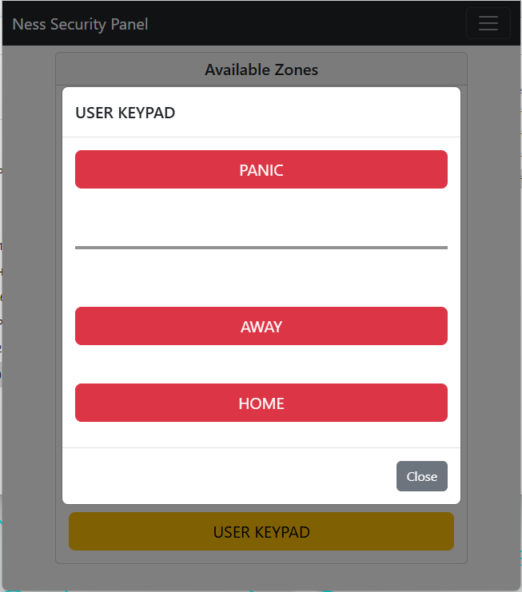
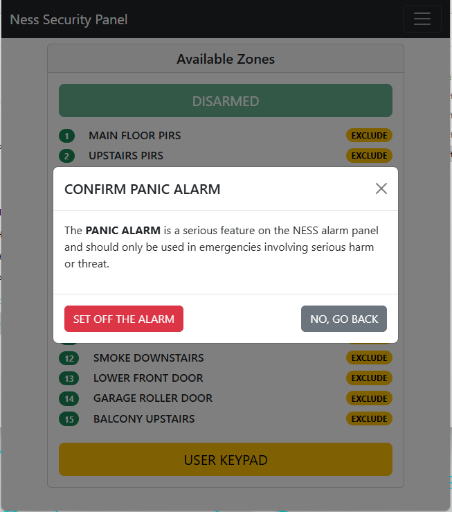

# NESS 2 Web API

## Web Application
The Ness 2 Web API includes a built-in web application designed for ease of use and accessibility. It supports multiple users at the same time, allowing simultaneous access.

The application can be opened on any device with a modern web browser such as a desktop, laptop, tablet, or smartphone. There is no need to download or install any additional apps. Simply navigate to the provided URL, log in if required, and start using the application.

This setup provides a consistent and hassle-free experience across devices, making it quick and easy to get started with minimal configuration.

### Arming the System
To arm the system, use the keypad interface shown below. There are three options available: **ARM**, **DISARM**, and **PANIC**. However, the **PANIC** option is only accessible to users with special privileges; primarily to prevent accidental activation, such as by children. Regular users will only see and be able to use the **ARM** and **DISARM** functions.

Please navigate to the next section for details on PANIC mode.

Once the user presses **ARMED HOME** or **ARMED AWAY**, the system will command the NESS Security panel accordingly, and the interface will change to reflect the current state of the alarm system.

### PANIC Mode

If the user has permission to access PANIC mode, the keypad will display a third option at the top labeled **PANIC**.

When this button is pressed, a confirmation dialog will appear that must be acknowledged. At this stage, the user still has the option to abort.

Once the user selects ***SET OFF THE ALARM***, the NESS Security panel will be triggered accordingly.
